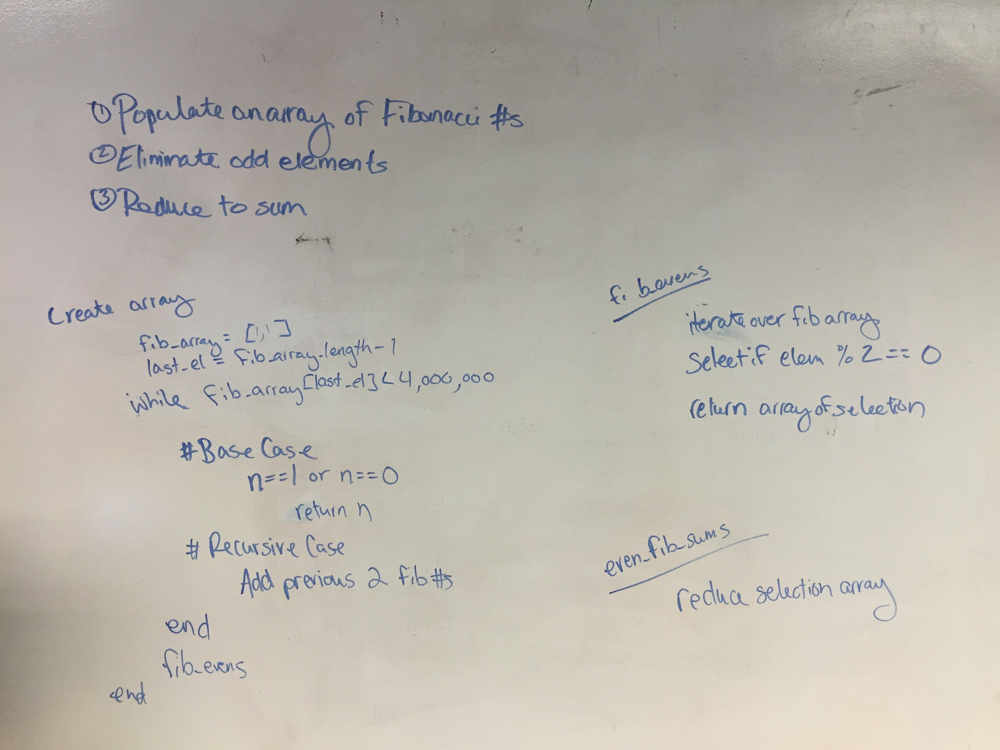

#Fibonacci Sums

##The Problem
Each new term in the Fibonacci sequence is generated by adding the previous two terms. By starting with 1 and 2, the first 10 terms will be:

1, 2, 3, 5, 8, 13, 21, 34, 55, 89, ...

By considering the terms in the Fibonacci sequence whose values do not exceed four million, find the sum of the even-valued terms.

##The Process
I started on the whiteboard:

I started attempting to tackle the problem recursively.  I ran into issues overflowing the stack, because the way I was looping was making the full recursive call for EACH additional fibonacci number.  I pivoted and went with an interative approach instead.

I worked to make all of my functions as single responsibility as possible.  
+ fibonnaciGenerator -- Populates an array of fibonacci numbers up to the upper limit
+ evens -- takes in an array and returns a new array of just the even numbers
+ sum -- takes in an array and adds all the elements together
+ fibonacciEvenSum -- combines the above three methods to solve the given problem